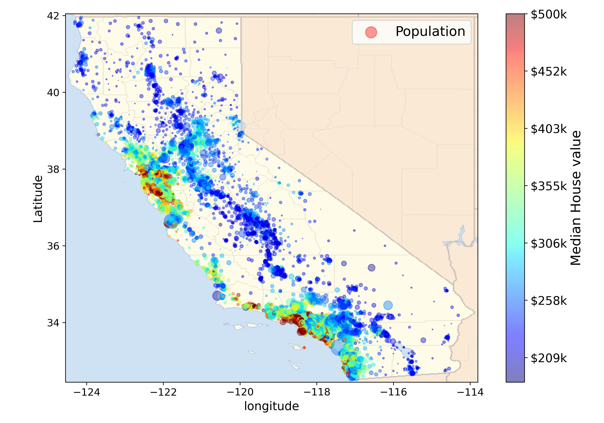

# Housing Prices California
This is an End to End ML Project on California Housing Prices Dataset from star lib repositry.
This dataset is based on  data from 1990 California Census.  
It is not Recent But it Has Many Qualities for Learning.  
### Let us see the Visualisation of the dataset over the Callifornia map representing population and the median house price.

  
The Features of the Dataset are:-  

- longitude            
-   latitude           
-   housing_median_age 
-   total_rooms        
-   total_bedrooms     
-   population         
-   households         
-   median_income      
-   median_house_value 
-   ocean_proximity         
### Quick Histogram visualization of the dataset:-  

### The Scatter Matrix of all the features is:- 

